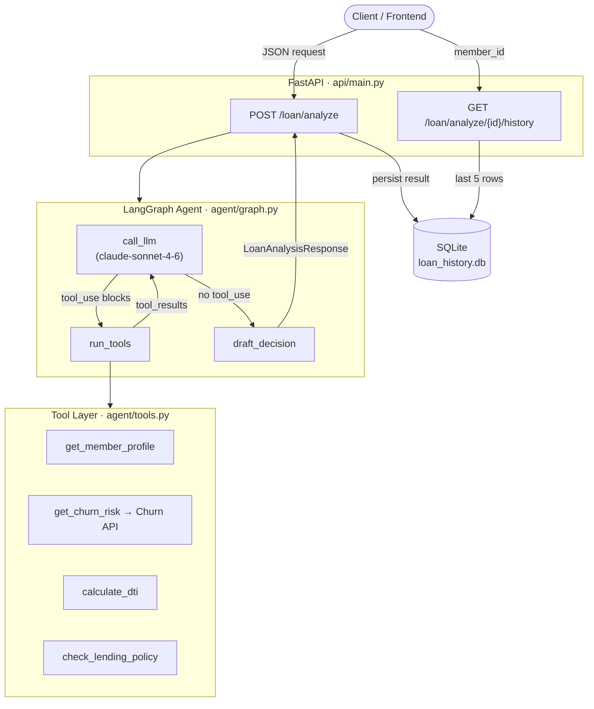

# 🏦 CU Loan Officer Agent

> An agentic loan officer assistant for credit unions — powered by Claude, orchestrated by LangGraph, and served via FastAPI.


---

## Overview

Given a member ID and a loan request, the agent autonomously:

1. Pulls the **member profile** (tenure, income, existing balances)
2. Fetches a **churn risk score** from the credit union's churn prediction API
3. **Calculates debt-to-income ratio** before and after the new loan
4. Checks the request against **hardcoded CU lending policy** limits
5. Synthesises all findings into a **structured approval recommendation**

The tool-calling loop runs until Claude is satisfied it has all necessary information, then produces a final JSON decision — keeping humans in the loop with a full audit trail of every tool call.

---

## Architecture



### Data Flow

| Step | Node | Output added to state |
|------|------|-----------------------|
| 1 | `call_llm` | Assistant message with tool_use blocks |
| 2 | `run_tools` | Tool results + `member_data`, `churn_data`, `dti_result`, `policy_result` |
| 3 | `call_llm` *(loop)* | Next reasoning step / more tool calls |
| 4 | `draft_decision` | `final_decision` — structured JSON |

---

## Tech Stack

| Layer | Technology | Role |
|-------|-----------|------|
| **LLM** | [Anthropic claude-sonnet-4-6](https://docs.anthropic.com) | Reasoning, tool orchestration, decision synthesis |
| **Agent framework** | [LangGraph](https://langchain-ai.github.io/langgraph/) | Stateful, cyclical graph with conditional routing |
| **API** | [FastAPI](https://fastapi.tiangolo.com) | Async REST endpoints, Pydantic validation |
| **ASGI server** | [Uvicorn](https://www.uvicorn.org) | Production-grade async server |
| **HTTP client** | [HTTPX](https://www.python-httpx.org) | Async calls to external churn prediction API |
| **Storage** | SQLite via [aiosqlite](https://aiosqlite.omnilib.dev) | Lightweight async history persistence |
| **Config** | python-dotenv | Secrets and environment management |
| **Deployment** | [Railway](https://railway.com) | Zero-config PaaS with persistent volumes |

---

## Quick Start (Local)

### 1 — Prerequisites

- Python 3.11+
- Running instance of the [CU Churn API](https://github.com/) (Project 5) — or the agent will fall back to synthetic risk scores
- Anthropic API key

### 2 — Install

```bash
git clone https://github.com/your-org/cu-loan-agent.git
cd cu-loan-agent
python -m venv .venv
# Windows
.venv\Scripts\activate
# macOS / Linux
source .venv/bin/activate

pip install -r requirements.txt
```

### 3 — Configure

```bash
cp cu_loan_agent/.env.example .env
```

Edit `.env`:

```env
ANTHROPIC_API_KEY=sk-ant-...
CHURN_API_URL=http://localhost:8001   # your churn prediction service
LOAN_DB_PATH=./loan_history.db       # SQLite file path (optional)
```

### 4 — Run

```bash
uvicorn cu_loan_agent.api.main:app --reload
```

API docs at **http://localhost:8000/docs**

### 5 — Test the agent

```bash
curl -X POST http://localhost:8000/loan/analyze \
  -H "Content-Type: application/json" \
  -d '{
    "member_id": "M001",
    "loan_type": "auto",
    "loan_amount": 22000,
    "term_months": 60
  }'
```

---

## API Reference

### `POST /loan/analyze`

Run the full agentic analysis for a loan request.

**Request body**

```json
{
  "member_id": "M001",
  "loan_type": "auto",
  "loan_amount": 22000.00,
  "term_months": 60
}
```

Supported `loan_type` values: `auto` · `personal` · `heloc`

**Response**

```json
{
  "member_id": "M001",
  "loan_type": "auto",
  "loan_amount": 22000.00,
  "approved": true,
  "churn_risk": "medium",
  "dti_projected": 0.3611,
  "policy_violations": [],
  "conditions": ["Proof of income required", "Gap insurance recommended"],
  "narrative": "Member has 8 years of tenure with 4 products. DTI within policy limits. Medium churn risk warrants a retention-focused conversation.",
  "processing_steps": [
    "get_member_profile",
    "get_churn_risk",
    "calculate_dti",
    "check_lending_policy"
  ]
}
```

---

### `GET /loan/analyze/{member_id}/history`

Return the last 5 analyses for a member.

**Response**

```json
{
  "member_id": "M001",
  "count": 2,
  "history": [
    {
      "id": 7,
      "member_id": "M001",
      "loan_type": "auto",
      "loan_amount": 22000.00,
      "term_months": 60,
      "approved": true,
      "churn_risk": "medium",
      "dti_projected": 0.3611,
      "policy_violations": [],
      "conditions": ["Proof of income required"],
      "narrative": "...",
      "processing_steps": ["get_member_profile", "get_churn_risk", "calculate_dti", "check_lending_policy"],
      "analyzed_at": "2026-05-23T14:02:11.004Z"
    }
  ]
}
```

---

## Lending Policy Rules

| Loan Type | Max DTI | Max Amount |
|-----------|---------|-----------|
| Auto | 45 % | $75,000 |
| Personal | 40 % | $25,000 |
| HELOC | 43 % | $250,000 |

---

## Deploying to Vercel

The repo ships with `vercel.json` and `api/index.py` so Vercel's Python runtime
can serve the FastAPI app directly — no framework changes required.

```bash
vercel deploy
```

**Required env vars in the Vercel dashboard**

| Variable | Value |
|----------|-------|
| `ANTHROPIC_API_KEY` | `sk-ant-...` |
| `CHURN_API_URL` | URL of your churn prediction service |
| `LOAN_DB_PATH` | `/tmp/loan_history.db` |

> **Limitations on Vercel**
> - **SQLite is ephemeral** — `/tmp` is wiped on each cold start, so the `/history` endpoint resets between deploys. Use Railway for persistent history.
> - **Function timeout** — `vercel.json` sets `maxDuration: 60` (Pro plan). The agent makes 4–6 sequential Anthropic calls; upgrade to Pro or Enterprise if you hit timeouts on Hobby.

---

## Deploying to Railway

Railway is the recommended host for a persistent, long-running backend.

### One-click deploy

[](https://railway.com/new/template)

### Manual deploy

```bash
npm install -g @railway/cli
railway login
railway init
railway up
```

Railway auto-detects `requirements.txt` and uses `Procfile` / `railway.toml` for the start command.

### Persistent SQLite volume

SQLite data is ephemeral by default on Railway. To persist it:

1. **Dashboard → your service → Volumes → Add Volume**
2. Set mount path: `/data`
3. Add environment variable: `LOAN_DB_PATH=/data/loan_history.db`

### Required environment variables

| Variable | Description |
|----------|-------------|
| `ANTHROPIC_API_KEY` | Your Anthropic API key |
| `CHURN_API_URL` | Base URL of the churn prediction service |
| `LOAN_DB_PATH` | *(optional)* Path to SQLite file — set to `/data/loan_history.db` with volume |

---

## Frontend Deployment

The API is CORS-ready for a separate frontend. Recommended options:

### ⭐ Vercel (Recommended)

Best fit for a **Next.js 14 App Router** frontend calling this API.

```bash
npx create-next-app@latest cu-loan-dashboard
cd cu-loan-dashboard
vercel deploy
```

Set `NEXT_PUBLIC_API_URL` as a Vercel environment variable pointing to your Railway backend.

**Why Vercel:** Zero-config CI/CD, edge caching for GET endpoints, built-in analytics, and seamless preview deployments per PR. Works perfectly with Railway as the backend host.

### Netlify

Good for **React + Vite** or **Astro** static frontends.

```bash
npm create vite@latest cu-loan-ui -- --template react-ts
netlify deploy
```

Set `VITE_API_URL` in Netlify's environment settings.

### Cloudflare Pages

Best choice if you want **edge-deployed** global distribution with Workers for lightweight proxying.

```bash
npm create cloudflare@latest cu-loan-ui -- --framework react
```

### Suggested Frontend Stack

| Layer | Library | Why |
|-------|---------|-----|
| Framework | Next.js 14 (App Router) | Server components, streaming, great DX |
| Styling | Tailwind CSS + shadcn/ui | Fast, accessible loan officer UI components |
| Data fetching | TanStack Query | Caching + automatic refetch for history |
| Forms | React Hook Form + Zod | Type-safe loan request form matching API schema |
| Charts | Recharts | DTI gauges, approval trend charts |
| Auth | Clerk | Drop-in SSO for credit union staff |

---

## Project Structure

```
.
├── requirements.txt
├── Procfile
├── railway.toml
├── README.md
└── cu_loan_agent/
    ├── __init__.py
    ├── loan_history.db          ← created on first run
    ├── agent/
    │   ├── __init__.py
    │   ├── state.py             ← AgentState TypedDict
    │   ├── tools.py             ← 4 tool functions + Anthropic schemas
    │   ├── graph.py             ← LangGraph state machine
    │   └── prompts.py           ← system prompt (future)
    └── api/
        ├── __init__.py
        ├── main.py              ← FastAPI app + SQLite persistence
        └── schemas.py           ← Pydantic request/response models
```

---

## Environment Variables Reference

```env
# Required
ANTHROPIC_API_KEY=sk-ant-...

# Required — churn prediction service (Project 5)
# Falls back to synthetic scores if unreachable
CHURN_API_URL=http://localhost:8001

# Optional — defaults to cu_loan_agent/loan_history.db
LOAN_DB_PATH=./loan_history.db
```

---

## License

MIT © 2026
# Agentic-Loan-Officer-Assistant
